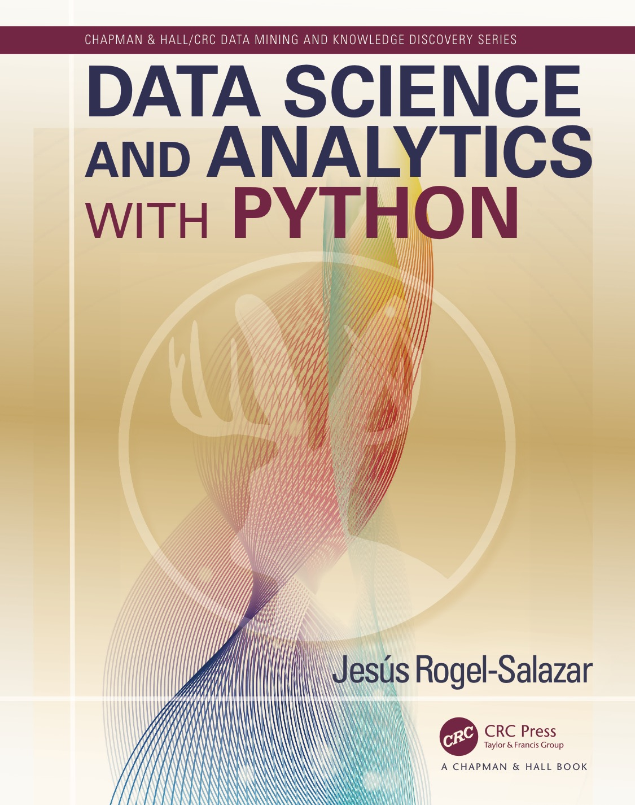

# Data Science and Analytics with Python

This respository contains the latest  code and source code [Data Science and Analytics with Python](http://bit.ly/DataSciencePython) (1st Edition). This code is available for you to play with, learn, fork and expand independently of your interest in the book. Nonetheless, if you find the code being of interest to you, I am sure you will benefit from getting a *non-pirated* copy of the book.

# Marketing Description

[Data Science and Analytics with Python](http://bit.ly/DataSciencePython)

Data Science and Analytics with Python is designed for practitioners in data science and data analytics in both academic and business environments. The aim is to present the reader with the main concepts used in data science using tools developed in Python, such as SciKit-learn, Pandas, Numpy, and others. The use of Python is of particular interest, given its recent popularity in the data science community. The book can be used by seasoned programmers and newcomers alike.

The book is organized in a way that individual chapters are sufficiently independent from each other so that the reader is comfortable using the contents as a reference. The book discusses what data science and analytics are, from the point of view of the process and results obtained. Important features of Python are also covered, including a Python primer. The basic elements of machine learning, pattern recognition, and artificial intelligence that underpin the algorithms and implementations used in the rest of the book also appear in the first part of the book.

Regression analysis using Python, clustering techniques, and classification algorithms are covered in the second part of the book. Hierarchical clustering, decision trees, and ensemble techniques are also explored, along with dimensionality reduction techniques and recommendation systems. The support vector machine algorithm and the Kernel trick are discussed in the last part of the book.

# Praise

> "Excellent book. It was easy to follow and very informative. The writing style is more informal and a bit jocular which is refreshing. The examples were clear and varied and also easy to follow.
>
> There's just something about this book which has made it so much easier to read than the numerous other books on this topic.
>
> Highly recommended"

— Andre DeCotiis-Mauro (via Amazon)

-j